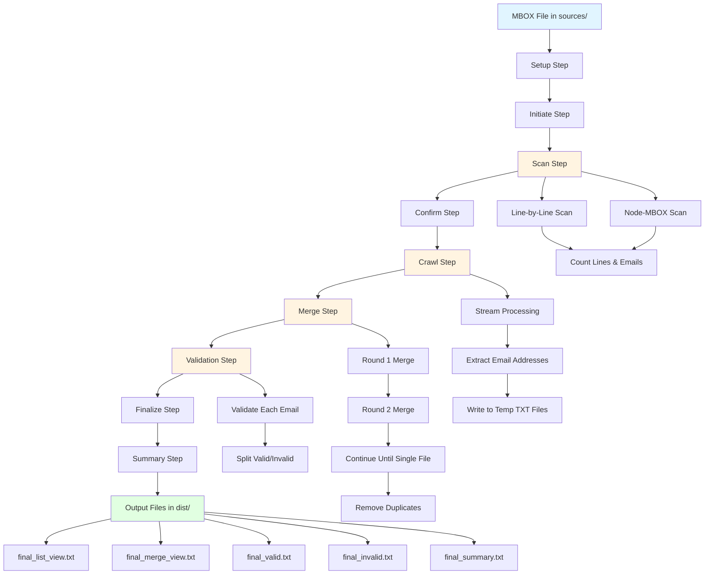
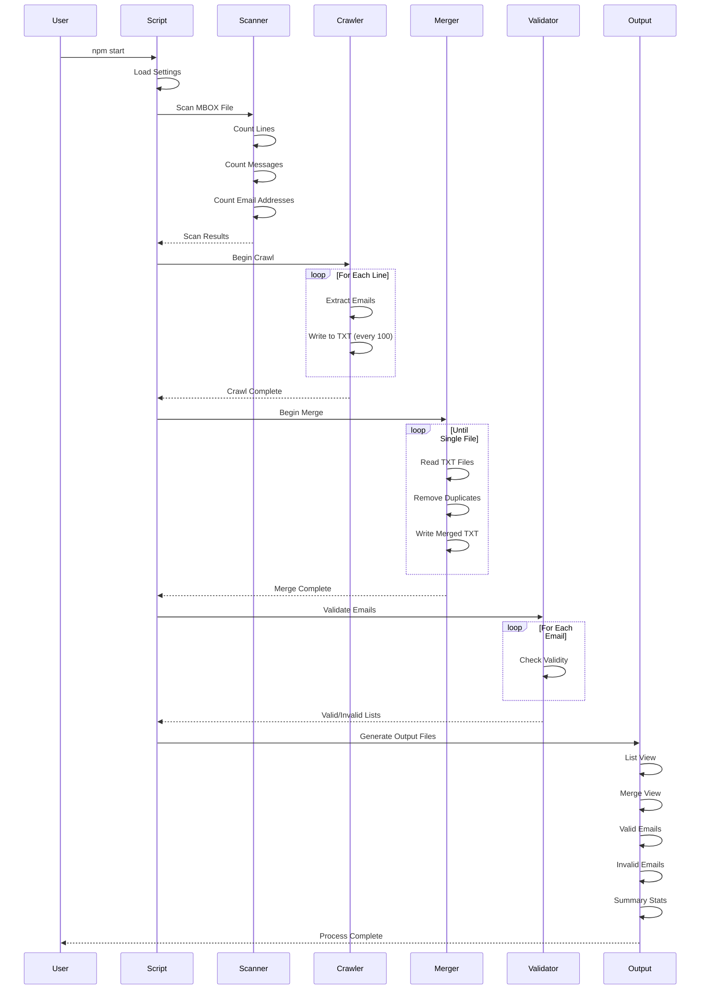

# MBOX Crawler

A Node.js application to process Gmail MBOX files and extract, validate, and deduplicate email addresses. Built in 2019 with stream-based processing for efficient handling of large email archives.

## Features

- 📧 Extracts email addresses from MBOX files (Gmail exports)
- 🔍 Dual-scan verification using multiple NPM packages
- 🔄 Recursive merge and deduplication of email addresses
- ✅ Email validation with detailed reporting
- 📊 Comprehensive statistics and progress tracking
- 💾 Memory-efficient stream processing for large files
- 📁 Organized output with multiple file formats
- 🔒 Configurable limits and safety checks
- 📈 Real-time progress display
- 🗂️ Backup functionality for application data

## Architecture Overview



## Process Flow



## Getting Started

### Prerequisites

- Node.js (v12 or higher)
- npm or yarn
- Sufficient disk space (at least 2x MBOX file size)

### Installation

1. Clone the repository:
```bash
git clone https://github.com/orassayag/mbox-crawler.git
cd mbox-crawler
```

2. Install dependencies:
```bash
npm install
```

3. Configure settings in `src/settings/settings.js` (optional)

### Configuration

Edit `src/settings/settings.js` to customize:

```javascript
{
  MAXIMUM_EMAIL_ADDRESSES_COUNT_PER_MBOX_FILE: 5000000,
  EMAIL_ADDRESSES_CRAWL_LIMIT_COUNT: 100,
  EMAIL_ADDRESSES_MERGE_LIMIT_COUNT: 100,
  MAXIMUM_MERGE_ROUNDS_COUNT: 10,
  // ... see INSTRUCTIONS.md for full list
}
```

## Usage

### Basic Usage

1. Place your MBOX file in the `sources/` directory
2. Run the crawler:
```bash
npm start
```
3. Find output files in the `dist/` directory

### Available Scripts

```bash
# Crawl MBOX files and extract email addresses
npm start

# Create backup of the application
npm run backup

# Stop the running process (Windows only)
npm run stop
```

### Output Files

After processing, you'll find these files in `dist/`:

- `{name}_final_list_view_{date}.txt` - All unique emails (one per line)
- `{name}_final_merge_view_{date}.txt` - All unique emails (comma-separated)
- `{name}_final_valid_{date}.txt` - Valid emails only
- `{name}_final_invalid_{date}.txt` - Invalid emails only
- `{name}_final_summary_{date}.txt` - Process statistics and summary

## Project Structure

```
mbox-crawler/
├── src/
│   ├── core/
│   │   ├── enums/          # Enumeration constants
│   │   └── models/         # Data models
│   ├── logics/             # Process orchestration
│   │   ├── backup.logic.js
│   │   └── crawl.logic.js
│   ├── scripts/            # Entry points
│   │   ├── backup.script.js
│   │   ├── crawl.script.js
│   │   └── error.script.js
│   ├── services/           # Business logic
│   │   ├── confirm.service.js
│   │   ├── crawl.service.js
│   │   ├── finalize.service.js
│   │   ├── initiate.service.js
│   │   ├── merge.service.js
│   │   ├── scan.service.js
│   │   ├── summary.service.js
│   │   └── validate.service.js
│   ├── settings/           # Configuration
│   │   └── settings.js
│   └── utils/              # Utility functions
│       ├── email.utils.js
│       ├── file.utils.js
│       ├── log.utils.js
│       ├── stream.utils.js
│       ├── text.utils.js
│       └── validation.utils.js
├── sources/                # Place MBOX files here
├── dist/                   # Output files
├── package.json
└── README.md
```

## How It Works

### 1. Setup & Initiate
- Validates settings and configuration
- Scans `sources/` directory for MBOX files
- Displays file information table

### 2. Scan
- Uses `line-by-line` package to count lines and extract emails
- Uses `node-mbox` package to count email messages
- Cross-validates results from both methods

### 3. Confirm
- Verifies file size within configured limits
- Checks available disk space
- Validates counts against maximum thresholds

### 4. Crawl
- Streams through MBOX file line by line
- Extracts email addresses using regex
- Writes emails to temporary TXT files (100 emails per file)
- Real-time progress display

### 5. Merge
- Recursively merges TXT files
- Removes duplicate email addresses
- Continues until single file remains
- Progress tracking for each merge round

### 6. Validation
- Validates each email address format
- Separates valid and invalid emails
- Delay between validations (configurable)

### 7. Finalize & Summary
- Cleanup temporary files
- Generate final output files in multiple formats
- Create comprehensive summary statistics
- Display results table

## Performance Characteristics

- **Memory efficient**: Stream-based processing avoids loading entire file into memory
- **Incremental writes**: Email addresses written to disk every 100 entries
- **Optimized merge**: Exponential merge strategy reduces I/O operations
- **Progress tracking**: Real-time display of processing status
- **Scalable**: Handles MBOX files up to 10GB (configurable)

## Use Cases

- Extract email addresses from Gmail exports for backup
- Build contact lists from historical email data
- Migrate contacts between email systems
- Analyze email communication patterns
- Clean and deduplicate email address lists
- Create mailing lists from email archives

## Technologies Used

- **Node.js** - Runtime environment
- **line-by-line** - Efficient line-by-line file reading
- **node-mbox** - MBOX file parsing
- **validator** - Email address validation
- **fs-extra** - Enhanced file system operations
- **check-disk-space** - Disk space verification
- **table** - Console table formatting
- **ESLint** - Code quality

## Error Handling

All errors include unique error codes for easy troubleshooting:
- Format: `Error message (1000XXX)`
- Codes range from 1000001 to 1000011
- Detailed error context logged to console

## Contributing

Contributions are welcome! Please read [CONTRIBUTING.md](CONTRIBUTING.md) for details on the process for submitting pull requests.

## Documentation

- [INSTRUCTIONS.md](INSTRUCTIONS.md) - Detailed setup and usage instructions
- [CONTRIBUTING.md](CONTRIBUTING.md) - Contribution guidelines

## Author

* **Or Assayag** - *Initial work* - [orassayag](https://github.com/orassayag)
* Or Assayag <orassayag@gmail.com>
* GitHub: https://github.com/orassayag
* StackOverflow: https://stackoverflow.com/users/4442606/or-assayag?tab=profile
* LinkedIn: https://linkedin.com/in/orassayag

## License

This project is licensed under the MIT License - see the [LICENSE](LICENSE) file for details.

## Acknowledgments

- Built for personal email management needs
- Inspired by the need to maintain contact lists from Gmail exports
- Designed for efficiency and reliability with large email archives
